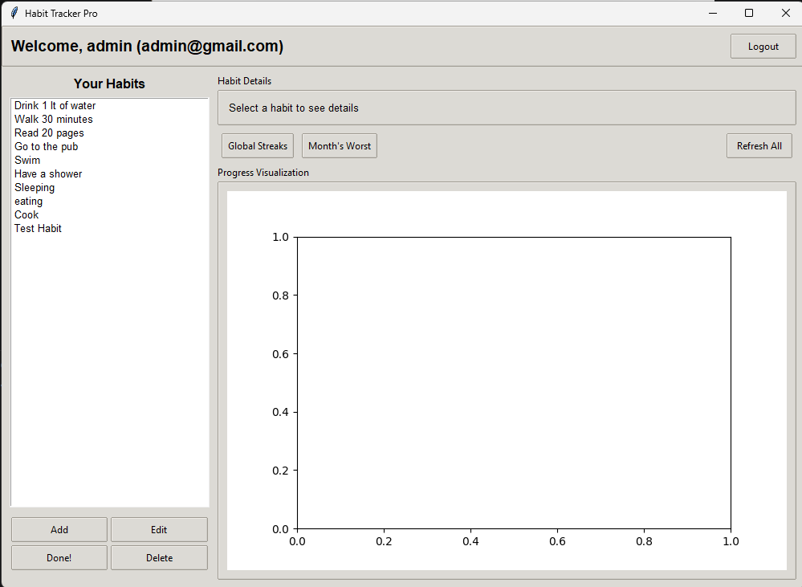
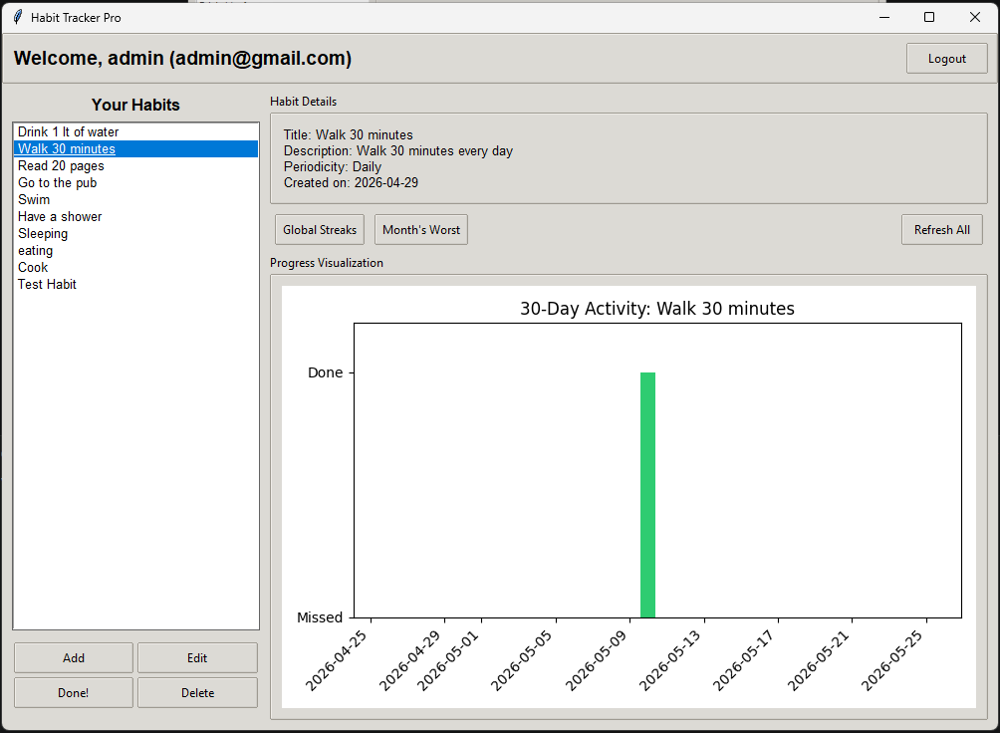
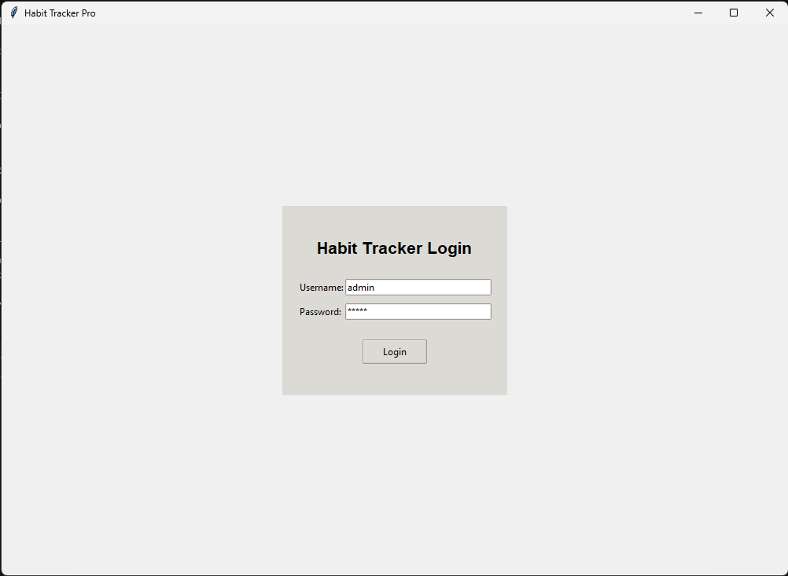

# Habit Tracker Application

## Overview
This Python-based habit tracker helps users create, monitor, and analyze daily and weekly habits through a Tkinter desktop application. It combines object-oriented models for habits with functional programming for analytics and visualizations.

## Key Features
- **Daily and Weekly Habit Management:**
  - Add, update, delete, or mark habits as completed.
  
- **Analytics:**
  - Visualize longest streaks for all habits.
  - Identify last month's worst-performing habit.

- **Predefined Data on Initialization:**
  - Application seeds the database with predefined habits and example data on first run.

## Installation
### Prerequisites
- Python 3.12+

### Steps
1. Clone this repository into your desired directory:
   ```bash
   git clone https://github.com/your-repo/habit-tracker.git
   ```

2. Navigate to the project folder:
   ```bash
   cd habit-tracker
   ```

3. Install dependencies:
   ```bash
   pip install tkinter
   ```

4. Run the application:
   ```bash
   python app.py
   ```

## Testing
- Unit tests for analytics and database modules are included.
- Execute tests using:
  ```bash
  pythom -m pytest
  ```

## Screenshots

- **Dashboard**

  

- **Analytics**

  

- **Habits & Streaks**

  

- **Login**

  

## Demo Video

A short demo video is included in the `assets` folder:

- `assets/20260525-0722-11.2756558.mp4`